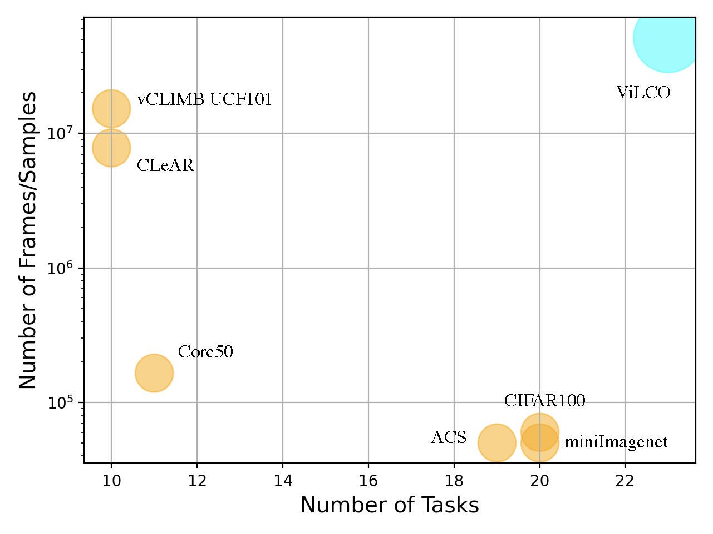
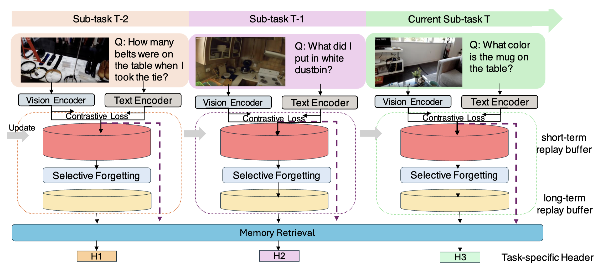
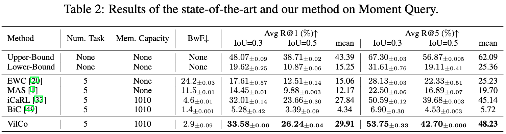
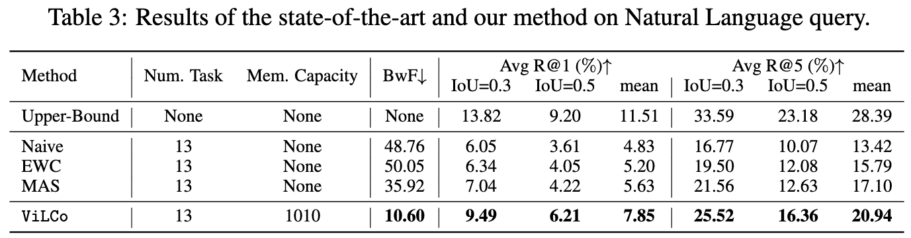

# 🎥 ViLCo-Bench: VIdeo Language COntinual learning Benchmark

| <a href="https://arxiv.org/abs/2406.13123" target="_blank">📃 Paper </a> |

## 🔥[2024.07] Introducing ViLCo-Bench  

Welcome to the official repository of **ViLCo-Bench**! 

This repository is the first dedicated benchmark designed to evaluate continual learning models across various video-text tasks. 
Unlike traditional continual learning tasks, **ViLCo** goes beyond classification and introduces challenges of cross-modal inference and temporal complexity in videos. 
We present three unique video-language continual learning tasks including:
* Moment Query (MQ),
* Natural Language Query (NLQ), and
* Vision Query (VQ).

Also, we provide a curated dataset with annotations for each episodic memory task. 
Additionally, we propose novel memory-efficient models tailored for **ViLCo-Bench**. 

In this repository, we provide the source code, access to the dataset, prepare the data, and the source code for training and evaluating **ViLCo** and other baselines across the benchmark.

## 📑 Table of Contents

- [🌟 Abstract](#-abstract)
- [📂 Repository Contents](#-repository-contents)
- [🛠️ Benchmark and Framework](#-benchmark-and-framework)
  - [Dataset Summary](#-dataset-summary)
  - [Leaderboard](#-leaderboard)
- [🚀 Getting Started](#-getting-started)
- [📚 Citation](#-citation)


## 🌟 Abstract

Video language continual learning involves continuously adapting to information from video and text inputs, enhancing a model’s ability to handle new tasks while retaining prior knowledge. This field is a relatively under-explored area, and
establishing appropriate datasets is crucial for facilitating communication and research in this field. In this study, we present the first dedicated benchmark,
ViLCo-Bench, designed to evaluate continual learning models across a range of video-text tasks. The dataset comprises ten-minute-long videos and corresponding
language queries collected from publicly available datasets. Additionally, we introduce a novel memory-efficient framework that incorporates self-supervised
learning and mimics long-term and short-term memory effects. This framework addresses challenges including memory complexity from long video clips, natural language complexity from open queries, and text-video misalignment. We posit that
ViLCo-Bench, with greater complexity compared to existing continual learning benchmarks, would serve as a critical tool for exploring the video-language domain,
extending beyond conventional class-incremental tasks, and addressing complex and limited annotation issues.





## 📂 Repository Contents

- **Dataset**: Ten-minute-long videos and corresponding language queries collected from publicly available datasets.
- **Benchmark Tasks**: Scripts and configurations to evaluate continual learning models on various video-text tasks.
- **Framework**: Implementation of **ViLCo**, our novel memory-efficient framework incorporating self-supervised learning.
- **Documentation**: Detailed documentation to help you get started with using the ViLCo-Bench benchmark.

## 🛠️ Benchmark and Framework



### Dataset Summary
We used Ego4D dataset consisting of 3670 hours of egocentric videos. We selected
videos and their corresponding queries and narrations to create three subsets for continual learning:
ViLCo-Bench-MQ, ViLCo-Bench-NLQ, and ViLCo-Bench-VQ.

| **Subset** | **Size** | **Action/Categories/Query**       | **# Videos** | **# Sub-Tasks**                        |
|--------|--------|-----------------------------------|--------------|----------------------------------------|
| **MQ** | 165H   | 110 action categories             | + 10,000     | 5 sub-tasks (22 action each) |
| **NLQ** | 136H   | 13 query templates | NA           | 13 sub-tasks                           | 
| **VQ** | 167H   | 2000 classes                      | NA           | 5 sub-tasks (400 categories each)      | 


### Leaderboard
#### Moment Query (MQ)


#### Natural Language Query (NLQ)


#### Natural Language Query (VQ)


## 🚀 Getting Started

### 💻 0 - Prerequisites

Before you begin, ensure you have met the following requirements:

- Python 3.8 or higher
- Required Python packages (see `requirements.txt`)

#### 🛠️ 0.1 - Installation

Clone this repository and install the necessary dependencies:

```bash
   conda create --name vilco python=3.8
   conda activate vilco

   # Install pytorch or use your own torch version
   conda install pytorch==1.12.0 torchvision==0.13.0 torchaudio==0.12.0 cudatoolkit=11.6 -c pytorch -c conda-forge

   git clone https://github.com/cruiseresearchgroup/ViLCo.git
   cd ViLCo
   pip install -r requirements.txt
```

#### 📁 0.2 - Repository Structure

The repository is organized as follows:

```bash
ViLCo-Bench
├── MQ
│   └── Feature extraction, Fine-tuning on EgoMQ with query-incremental setting 
├── NLQ
│   └── Feature extraction and head-tuning on EgoNLQ with query-incremental setting 
└── VQ
    └── Head-tuning on EgoVQ with query-incremental setting 

```
Each directory contains data preparation, training/inference scripts, and we provided pre-extracted video and text features for new CL tasks.


### 📊 1 - Dataset 
We provide metadata for the proposed MQ/NLQ/MQ tasks, detailing data subsets aligned with the tasks in each CL setup. To facilitate a quick start, we include pre-extracted visual and textual features. Additionally, we offer instructions for preparing the full datasets, allowing for easy extension to custom multi-modal data sources.

#### Fast start
Downdown pre-extracted features from zenodo [Link](https://zenodo.org/records/11560095). Note that you should download all files in your folder, then run ```unzip ViLCo_data.zip```.

<details>
  <summary>Details:</summary>

  The data structure is shown as below:
  ```bash
  ViLCo_data
  ├── feature_extraction
  │   └── Feature extraction script for custom dataset, download scripts for additional visual features
  ├── features
  │   └── pre-extratced visual features.
  ├── MQ_meta_data
  │   └── metadata for moments query.
  ├── NLQ_meta_data
  │   └── metadata for natural language query.
  ├── VQ_meta_data
  │   └── metadata for visual query.
  └── narration_data
      └── pre-extracted narration features for self-supervised training.
  ```

  We provide pre-extracted features in ``features/``. You should also download visual features by provided scripts.
  ##### For NLQ
  ```
  cd feature_extraction
  ```
  Download the EgoVLP features (optional: Internvideo, SlowFast)
  ```
  python download_features.py --feature_types egovlp
  ```
  Convert the feature into lmdb
  ```
  python convert_pt_to_lmdb.py
  ```

  For textual feature:

  Please refer to [How_to_start](https://ego4d-data.org/docs/start-here/) to download CLIP textual features step by step. Note that the data type should be Features. You could also refer to [CLIP_TEXT_TOKEN_EXTRACTOR](https://github.com/houzhijian/CONE/blob/main/feature_extraction/ego4d_clip_token_extractor.py) by extracting features manually.

  ##### For MQ
  The EgoVLP-v2 features could also be downloaded as:
  ```
  wget https://www.cis.jhu.edu/~shraman/EgoVLPv2/pre-extracted_features/EgoMQ/EgoVLPv2.tgz
  tar -xvzf EgoVLPv2.tgz && rm EgoVLPv2.tgz
  ```

  For textual feature:
  We provide extracted features in ``features/MQ``.

  ##### For VQ
  Please follow [vq2d baseline](https://github.com/EGO4D/episodic-memory/tree/main/VQ2D#preparing-data-for-training-and-inference) step 1/2/4/5 to process the dataset into video clips.

  ##### Meta data
  ``NLQ_meta_data/ego4d_nlq_{split}_v2.jsonl`` includes clip annotations & query information on NLQ.
  ``NLQ_meat_data/ego4d_nlq_query_incremental_13.pkl`` includes splitted data for CL sub-tasks on NLQ.
  ``MQ_meta_data/ego4d_clip_annotations_v2.json`` includes clip annotations & query information on MQ.
  ``MQ_meat_data/ego4d_mq_query_incremental_22_all.pkl`` includes splitted data for CL sub-tasks on MQ.
  ``MQ_meta_data/vq_{split}.json`` includes clip annotations & query information on VQ.
  ``MQ_meat_data/ego4d_vq_query_incremental_5.pkl`` includes splitted data for CL sub-tasks on VQ.

  ##### Narration data
  See in ``narration_data``

  You could also download ViLCo_data from google driver [Link](https://drive.google.com/file/d/1F3w_RqGPHl71BLbp5T6HYBOt-H8zuT0W/view?usp=drive_link)
  </details>

#### Fully preparation
1. Download original video data from Ego4d. Pleas refer to [Start Here](https://ego4d-data.org/docs/start-here/) to download the full videos and their corresponding annotations. After you download the CLI, you could run command ```ego4d --output_directory="~/ego4d_data" --datasets full_scale annotations```.
2. Extract visual/textual features for data pre-processing. In our paper, we finally use [EgoVLP-v2](https://shramanpramanick.github.io/EgoVLPv2/) features. Also, the combination of multiple visual features can achieve good results. 
    <details>
    <summary>Details:</summary>
    For offline data prepartion, please follow the same steps as below:
  
    In MQ, use `python convert_annotation.py` to convert the official annotation to the processed one. And put it into `MQ/data/ego4d`. create a config file corresponding to training. And put it into `MQ/configs/`.
  
    In NLQ, please refer to [File_Precess_RM](https://github.com/houzhijian/GroundNLQ/tree/main/ego4d_data).
  
    In VQ, please refer to the five steps in [Preparing Dataset](https://github.com/facebookresearch/vq2d_cvpr/blob/main/INSTALL.md).
    </details>

3. Generate metadata for specific tasks. we provide corresponding scripts in ```scripts\```. Put the python file into its corresponding task dictionary and change the detailed data path.


### 📊 2 - Evaluation 
Run the following command to train and evaluate the model across MQ tasks:
```
    bash train_cl.sh mq_vilco DEVICE_NO PORT_NO
```

(taking MQ as an example), it will automatically validate performance on val-set (e.g., average mAP, Recall@1x).

#### Add new tasks
For expanding ViLCo to custom data/tasks, please refer to [Add New Task](Add_New_Task.md).

## 🤝 Contributing
We welcome contributions to the ViLCo-Bench benchmark! Please feel free to join the leaderboard, open issues, submit pull requests, or provide suggestions.

## 📜 License
ViLCo is licensed under a [MIT License](./LICENSE).

## 🙏 Acknowledgement and Disclosure of Funding342
This code is inspired by [vCLIMB](https://github.com/ojedaf/vCLIMB_Benchmark). We develop the benchmark model, inspired by [EgoVLP](https://github.com/showlab/EgoVLP), [EgoVLP-v2](https://github.com/facebookresearch/EgoVLPv2), [Ego4D-ASL](https://github.com/JonnyS1226/ego4d_asl), [Ground-NLQ](https://github.com/houzhijian/GroundNLQ), [VQLoC](https://github.com/hwjiang1510/VQLoC). Thanks for their contributions.

This material is based upon work supported by the International Technology Center Indo-Pacific343
(ITC-IPAC) under Contract No. FA520923C0020.

## 📚  Citation
If you use ViLCo-Bench in your research, please cite our paper:
```
@article{Tang2024vilco,
  title={ViLCo-Bench: VIdeo Language COntinual learning Benchmark},
  author={Tianqi Tang, Shohreh Deldari, Hao Xue, Celso De Melo, Flora Salim},
  journal={Under review},
  year={2024},
}
```

Thank you for using ViLCo-Bench! We hope this benchmark serves as a valuable resource for your research in video-language continual learning.

